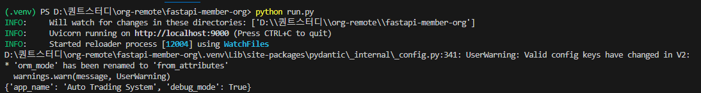
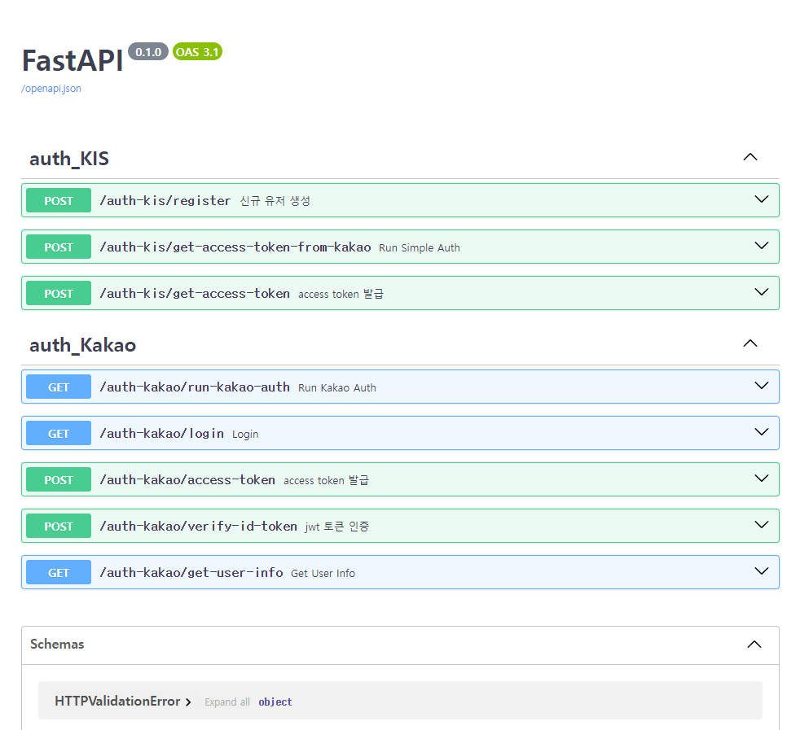

## 📜 ref
| No. | url | description |
|---|----------|-----| 
| 1 | https://fastapi.tiangolo.com/ko/python-types/| type hint
| 2 |https://velog.io/@cho876/%EC%9A%94%EC%A6%98-%EB%9C%A8%EA%B3%A0%EC%9E%88%EB%8B%A4%EB%8A%94-FastAPI | about FastAPI
| 3 |https://wikidocs.net/175092 | FastAPI wiki
| 4 |https://velog.io/@shangrilar/FastAPI-%EC%8B%9C%EC%9E%91%ED%95%98%EA%B8%B0 | FastAPI 시작 & 실행


## 🖥️ 실행
**OS : Window 11 Home**<br>
**Python : python3.11.9**<br>
**IDE : VSCode**<br>

1. **가상환경 생성**
    ```bash
    python -m venv .venv
    ```

2. **패키지 설치 & 가상환경 실행**
    ```bash
    .\.venv\Scripts\Activate # 가상환경 실행
    pip install -r requirements.txt # 가상환경 패키지 설치
    ```
    

3. **환경변수 설정**
    - 프로젝트 홈 디렉토리에 .env 파일 생성
    - 다음 형식의 환경 변수 작성
    ```
    COMMON_APP_NAME=Auto Trading System     # App Name
    COMMON_DEBUG_MODE=True                  # Debug Mode
    COMMON_APP_HOST=localhost               # FastAPI App 실행 host
    COMMON_APP_PORT=9000                    # FastAPI App 실행 Port
    ```

4. **FastAPI 서버 실행**
    ```bash
    python run.py
    ```

**실행 결과**
